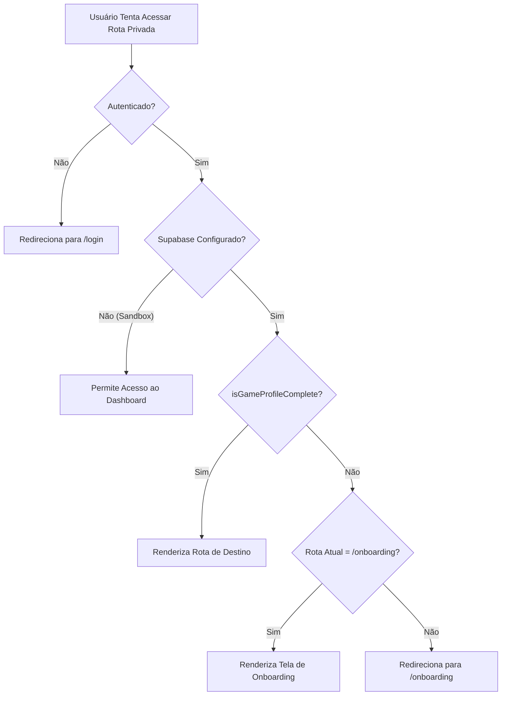

# Fluxo de Onboarding de Perfil Gamer // Manual Operacional

Este documento detalha o fluxo de Onboarding implementado no **Duo Loot** para completar o perfil tático do operador após o registro. Isso garante que todo jogador tenha dados de matchmaking, preferências de áudio e informações competitivas reais antes de ingressar nos Lobbies ou receber recomendações.

---

## 1. Arquitetura e Engenharia de Dados

### 1.1 Persistência no Banco de Dados
Os dados de jogo são mantidos em `public.profiles` sob o campo `game_profile` (tipo `JSONB`).
A estrutura real segue a definição rigorosa de tipo em TypeScript e validação de schema Zod:

```typescript
export interface OnboardingData {
  nickname: string;         // Nickname competitivo do operador
  main_game: string;        // Jogo principal (valorant, league_of_legends, tft)
  rank: string;             // Rank competitivo de ferro a radiante/desafiante
  main_role: string;        // Função principal desempenhada no time
  secondary_role?: string;  // Função secundária
  play_style: string;       // Estilo tático (competitivo, casual, etc.)
  session_focus: string;    // Objetivo (subir rank, treinar, etc.)
  mic_required: boolean;    // Necessidade de áudio de comunicação
  availability: string;     // Faixa horária preferida
  preferred_modes: string[];// Modos preferidos (Competitivo, Arena, etc.)
}
```

### 1.2 Integridade e Sincronização
Para evitar divergências em consultas relacionais, o serviço `updateMyGameProfile(payload)` realiza uma atualização de duas vias:
1. Grava o payload completo serializado em `profiles.game_profile`.
2. Sincroniza a coluna `nickname` de `profiles` diretamente com o valor do nickname inserido no formulário pelo usuário.
3. Transiciona o status do operador para `online` ativando sua presença.

---

## 2. Roteamento e Segurança Tática

O controle de acesso é implementado nativamente através do `ProtectedRoute.tsx`:



### 2.1 Evitando Loop de Redirecionamento
A inteligência do `ProtectedRoute.tsx` analisa o estado do `useLocation()` da rota atual:
- Se o operador logado possuir um perfil incompleto mas estiver ativamente na rota `/onboarding`, o redirecionamento é suspenso para que ele consiga preencher o formulário sem travas.

---

## 3. Componentes e Estrutura HUD

O fluxo de Onboarding foi construído de forma desacoplada seguindo a arquitetura oficial do projeto:

*   **[onboarding.schema.ts](file:///d:/meusProjeto/duoloot/src/features/onboarding/onboarding.schema.ts):** Contém enums estritos e a validação via Zod com mensagens personalizadas em português.
*   **[onboarding.service.ts](file:///d:/meusProjeto/duoloot/src/services/onboarding.service.ts):** Encapsula a lógica de salvamento robusto no Supabase, mesclando chaves legadas e garantindo que chaves nulas não apaguem dados.
*   **[OnboardingStepCard.tsx](file:///d:/meusProjeto/duoloot/src/features/onboarding/components/OnboardingStepCard.tsx):** Fornece painéis táticos com a identidade visual *Tactical Underground Loot*.
*   **[OnboardingForm.tsx](file:///d:/meusProjeto/duoloot/src/features/onboarding/components/OnboardingForm.tsx):** Stepper tático de 3 passos integrado com `react-hook-form` e `zodResolver`.
*   **[OnboardingTemplate](file:///d:/meusProjeto/duoloot/src/templates/OnboardingTemplate/index.tsx):** Split-screen de alta fidelidade conectando o Stepper de formulário ao painel lateral **Operator Card Preview** que reflete escolhas em tempo real.
*   **[OnboardingPage.tsx](file:///d:/meusProjeto/duoloot/src/pages/OnboardingPage.tsx):** Controlador de página que lê os dados competitivos atuais, gerencia o loading radar de inicialização, envia o payload e dispara a renovação de sessão (`refreshProfile()`).

---

## 4. Estética Visual de Combate

Fiel ao design tático, a interface do Onboarding utiliza:
- **Painéis HUD:** `.dl-panel`, cantos cortados HUD com clip-path, e fitas táticas de aviso de alerta.
- **Preview Lateral:** Um card de operador militar em tempo real que renderiza as funções, ranks e jogos ativos selecionados pelo operador nos passos do formulário.
- **Interações Suaves:** Transições suaves nos passos do stepper, botões neon dinâmicos e micro-animações de pulso de radar nos loadings.
- **Resiliência a Sandbox:** A interface avisa o operador se o Supabase não estiver ativado, permitindo testes locais no modo sandbox.
